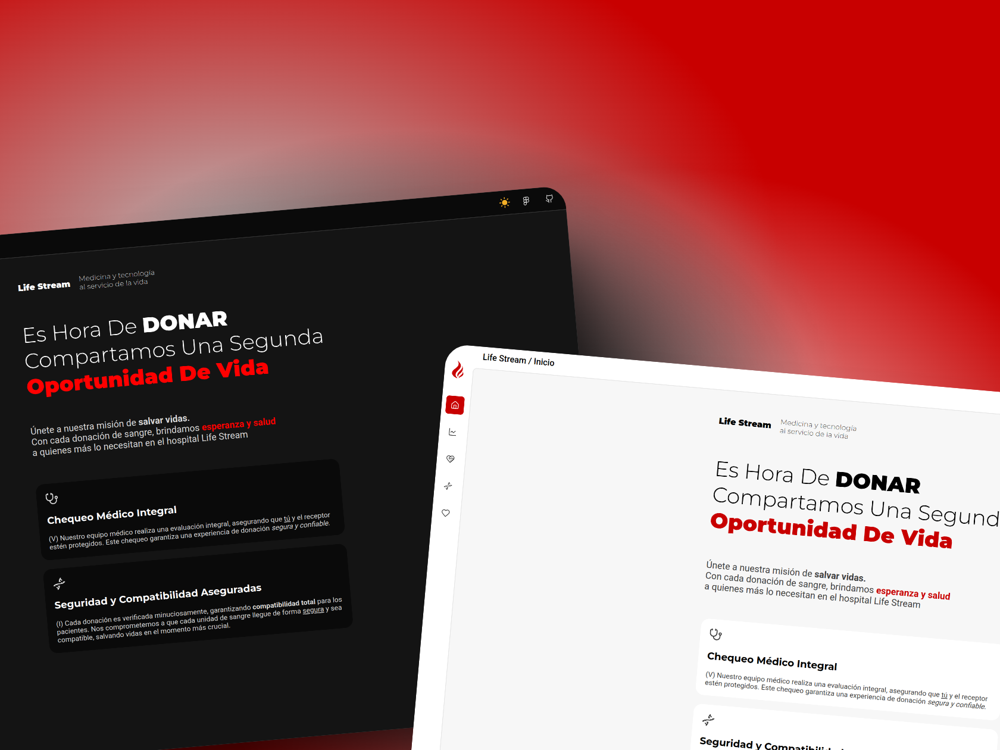
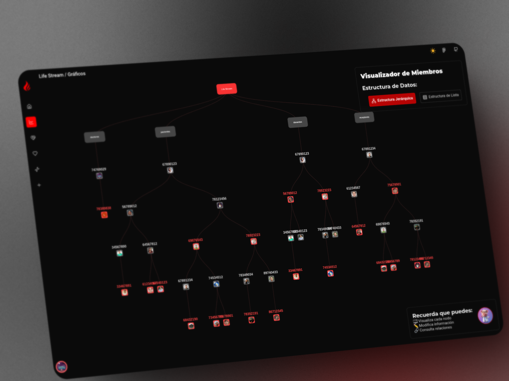
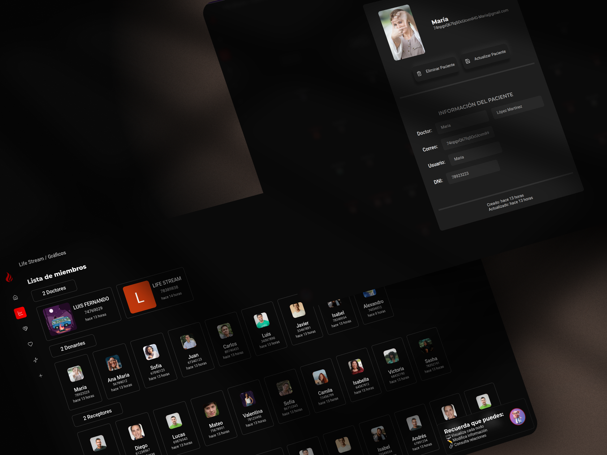
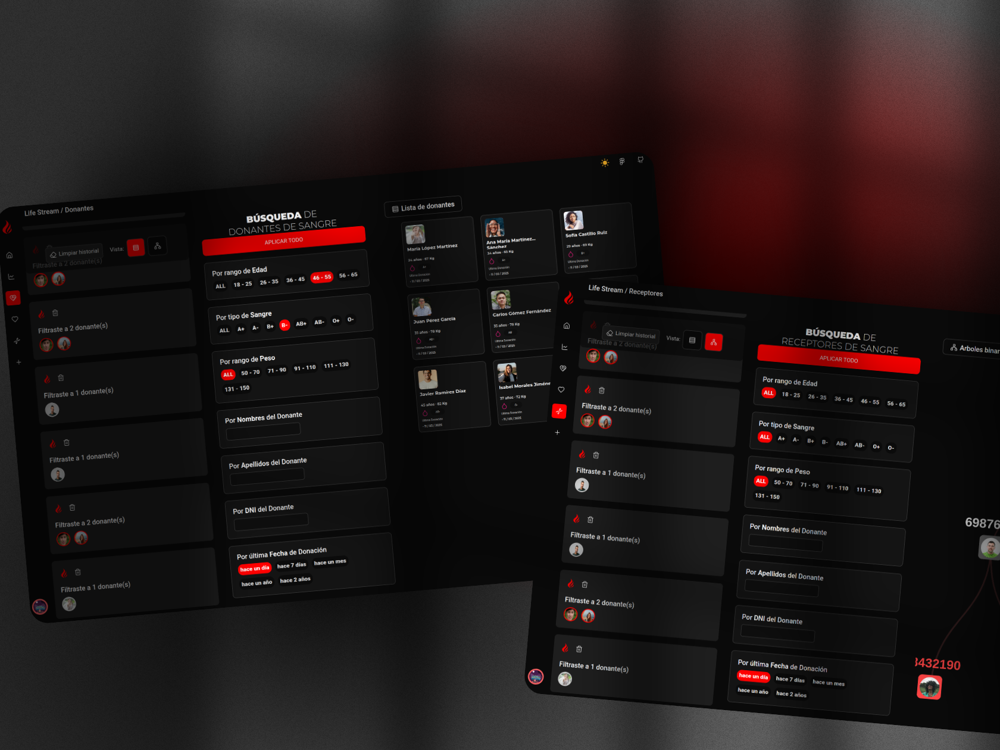

# 🌟 Life-Stream

[](https://life-stream.vercel.app)
[](https://www.figma.com/design/Qe9Z000000000000000000000000000000000000/Life-Stream?node-id=0-1&t=0-0)
[](https://opensource.org/licenses/MIT)
[](https://aiven.io)

<div style="column-count: 2; margin: 20px 0;">
  
  
  
  
</div>

---

## 🎯 **Sobre el Proyecto**

**Life-Stream** es un proyecto educativo con el objetivo de facilitar el proceso de agregar pacientes donantes y receptores de sangre en la ciudad de Lima, Perú. Con esta herramienta, buscamos eliminar los tediosos registros manuales, permitiendo que el proceso sea más eficiente y accesible para todos los usuarios.

---

## ✨ **Características**

- ✅ **Registro automático**
- 🎨 **Interfaz intuitiva**
- 📊 **Visualización de datos** mediante árboles binarios
- 🔒 **Seguridad**
- 🎭 **Manejo de roles** como Donante, Receptor, Administrador y Usuarios

---

## 🛠️ **Tecnologías**


---

## 👨‍💻 **Desarrollador**

[](https://github.com/Luis-Fernando-MP)

---

## 🚀 **Instalación**

1. **Instala [Node.js v20](https://nodejs.org/en/)**

2. **Instala PNPM globalmente:**

   ```bash
   npm install -g pnpm

   ```

3. Clona el repositorio:

   ```bash
   git clone https://github.com/Luis-Fernando-MP/life-stream.git
   cd life-stream
   ```

4. Instala las dependencias:

   ```bash
   pnpm install
   ```

5. Configura las variables de entorno:

   - Crea un archivo `.env` en la raíz del proyecto
   - Copia las siguientes variables y configura sus valores:

   ```env
    # Aiven db
    DATABASE_URL=mysql://

    # Clerk
    NEXT_PUBLIC_CLERK_PUBLISHABLE_KEY=
    CLERK_SECRET_KEY=
    NEXT_PUBLIC_CLERK_SIGN_IN_URL=/sign-in
    NEXT_PUBLIC_CLERK_SIGN_UP_URL=/sign-up

    # Clerk Webhooks
    WEBHOOK_SECRET=

    #Web URL
    NEXT_PUBLIC_URL="http://localhost:3000"

    # Cloudinary
    CLOUDINARY_CLOUD_NAME=
    CLOUDINARY_API_KEY=
    CLOUDINARY_API_SECRET=
    CLOUDINARY_URL=
    CLOUDINARY_PRESET=
   ```

6. Ejecuta el proyecto en modo desarrollo:

   ```bash
   pnpm dev
   ```

7. Para compilar el proyecto para producción:
   ```bash
   pnpm build
   pnpm start
   ```

### ¡Gracias por tu interés en Life-Stream! Juntos, podemos hacer la diferencia en la gestión de donaciones de sangre. 💖
